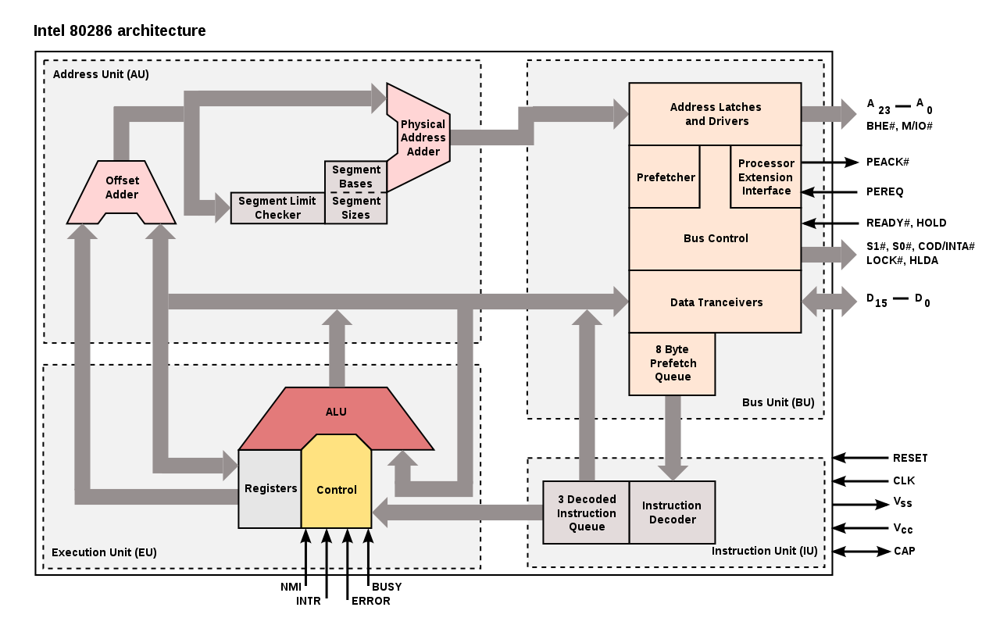
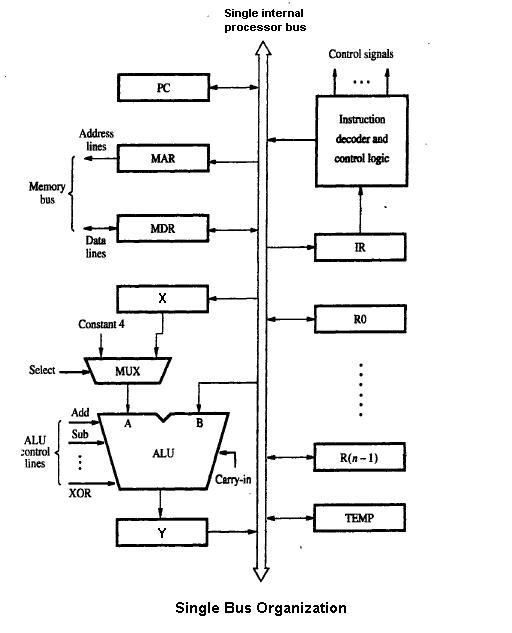

- x86-64 (aka x64, x86_64, AMD64 and Intel 64) is the 64-bit version of the x86 instruction set. popular among computers.
- x86 is a family of backward-compatible instruction set architectures based on the Intel 8086 CPU and its Intel 8088 variant.
- Instruction set architecture (ISA)(programming model) is an abstract model of a computer.(machine language)
  - instruction set consists of addressing modes, instructions, native data types, registers, memory architecture, interrupt, and exception handling, and external I/O.
  - Micro architecture is a way ISA, is implemented in a particular processor.
  
  
  
  - https://en.wikipedia.org/wiki/Microarchitecture
  - https://en.wikipedia.org/wiki/Instruction_set_architecture
  - https://en.wikipedia.org/wiki/Central_processing_unit
- Advanced RISC Machine (ARM) architecture is popular among smartphones.
  - https://en.wikipedia.org/wiki/ARM_architecture

## Architecture
- 8086
  -  16-bit extension of Intel's 8-bit-based 8080 microprocessor
  -  memory segmentation as a solution for addressing more memory
- 8080
- https://en.wikipedia.org/wiki/X86-64
- https://en.wikipedia.org/wiki/X86
- https://stackoverflow.com/questions/29467510/how-does-multi-level-page-table-save-memory-space